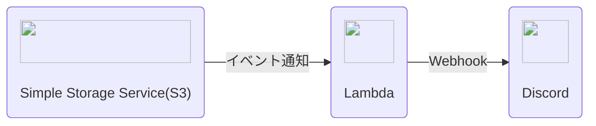

```mermaid
flowchart LR
   Discord("<img src='../images/Mermaid/discord.png'; width='50'; height='50' /><br>Discord")
   Lambda("<img src='../images/Mermaid/AWS_Lambda.png'; width='50'; height='50' /><br>Lambda")
   S3("<img src='../images/Mermaid/AWS_S3.png'; width='50'; height='50' /><br>Simple Storage Service(S3)  ")

   S3 -- イベント通知 --> Lambda
   Lambda -- Webhook --> Discord
```
